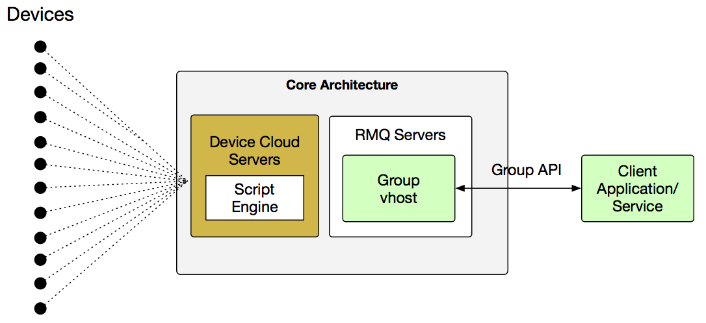
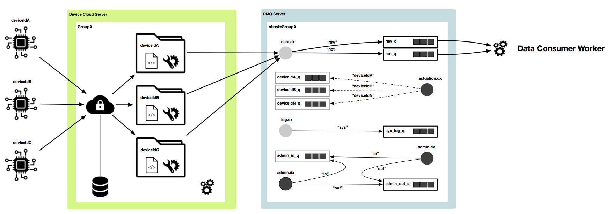
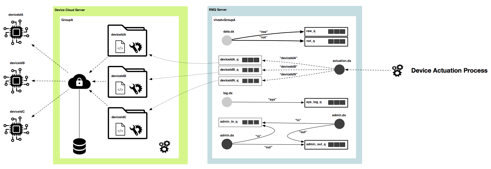
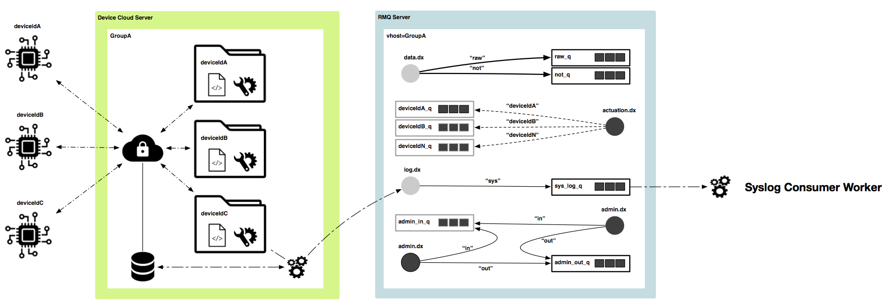
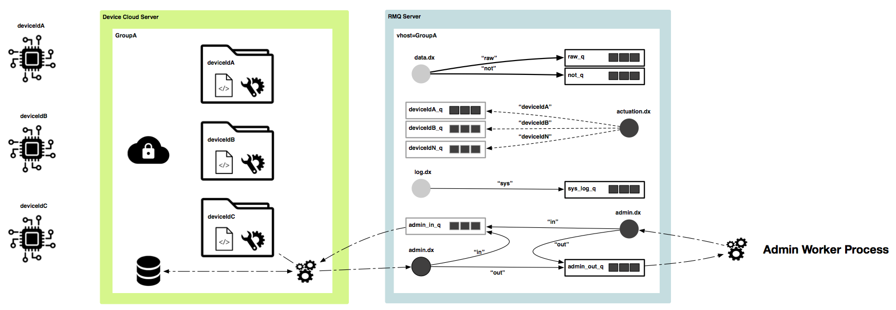

# User Guide for the Avimesa Group API (AMQP)
*last updated 2018-Nov-28*

## Introduction
This project contains the Avimesa Group API documentation.  The purpose of this documention is to describe the API available for the Avimesa Group clients. The Group API (AMQP) in general can be seen as a JSON based protocol that uses Avimesa-configured RabbitMQ for messaging and provides the ability to interface with the Avimesa system.


<a id="toc"></a>
## Table of Contents
- [1. Summary](#1.-summary)
    - [1.1 Overview](#1.1-summary)
    - [1.2 Client Examples](#1.2-summary)
    - [1.3 References](#1.3-references)
    - [1.4 Terminology](#1.4-terminology)
- [2. Components](#2.-components)
    - [2.1 Avimesa Core Architecture](#2.1-components)
        - [2.1.1 Devices](#2.1.1-components)
        - [2.1.2 Device Cloud Servers](#2.1.2-components)
        - [2.1.3 Script Engine](#2.1.3-components)
        - [2.1.4 Group vhosts](#2.1.4-components)
        - [2.1.5 Group vhost Client](#2.1.5-components)
- [3. Recommended Client Usage](#3.-client-usage)
    - [3.1 Consumer/User/Producer](#3.1-client-usage)
    - [3.2 Data Consumer Worker](#3.2-client-usage)
    - [3.3 Device Actuation Process](#3.3-client-usage)
    - [3.4 Syslog Consumer Worker](#3.4-client-usage)
    - [3.5 Admin Worker Process](#3.5-client-usage)
- [4. Group API](#4.-group-api)
    - [4.1 General Data Flow](#4.1-group-api)
        - [4.1.1 AMQP Permissions](#4.1.1-group-api)
        - [4.1.2 Command Requests](#4.1.2-group-api)
        - [4.1.3 Command Responses](#4.1.3-group-api)
        - [4.1.4 Raw Data Subscription](#4.1.4-group-api)
        - [4.1.5 Notification Data Subscription](#4.1.5-group-api)
        - [4.1.6 System Log Data Subscription](#4.1.6-group-api)
    - [4.2 List Devices - Command 1002](#4.2-group-api)
    - [4.3 Add a Device - Command 1004](#4.3-group-api)
    - [4.4 List a Device's Files - Command 1006](#4.4-group-api)
    - [4.5 Upload a Device Driver Script File - Command 1008](#4.5-group-api)
    - [4.6 Upload a Device Configuration File - Command 1010](#4.6-group-api)
    - [4.7 Remove a Device - Command 1012](#4.7-group-api)
    - [4.8 Update a Device's Authentication Key - Command 1014](#4.8-group-api)
    - [4.9 Upload a Device Firmware Update Package - Command 1020](#4.9-group-api)
    - [4.10 Actuation](#4.10-group-api)
        - [4.10.1 Summary](#4.10.1-group-api)
        - [4.10.2 Set GPIO State - Command 0xB102](#4.10.2-group-api)
        - [4.10.3 Soft Reset - Command 0xF002](#4.10.3-group-api)
        - [4.10.4 Firmware Update Trigger - Command 0xF008](#4.10.4-group-api)
    - [4.11 System Log](#4.11-system-log)
        - [4.11.1 Summary](#4.11.1-system-log)
        - [4.11.2 JSON Format](#4.11.2-system-log)
        - [4.11.3 System Log Event IDs](#4.11.3-system-log)
- [5. DialTone QuickStart](#5.-dt-quickstart)
    - [5.1 Summary](#5.1-dt-quickstart)
    - [5.2 Typical Device Data](#5.2-dt-quickstart)
    - [5.3 Typical Device Configuration](#5.3-dt-quickstart)
    

The following lists larger API updates.  See github for complete changelog of the smaller changes.
    
| API Version |Change |
| --- | ---  |
| 0.10 | Initial release on github|
| 0.11 | - Changed CMD 1XXX responses.  Instead of a generic "message" arrary of strings, the response is now a JSON object that is easier to consume |

    
<a id="1.-summary"></a>
## 1. Summary

<a id="1.1-summary"></a>
### 1.1 Overview
The Group API supports the following:
 
**Direct Device Interaction**
- Ability to consume/subscribe to device data (raw/notification)
- Queue based data access
- Ability to actuate devices (i.e. send commands that elicit a device action)

**Device Management and Provisioning**
- Ability provision and remove devices
- Ability to set a device script and configuration - Ability to reset device authentication keys
- Ability to list devices/device files

**Device and System Administration**
- update device firmware (support for Avimesa 1000, but in general provides agnostic DFU style operations)
- view system logs

**Security**
- TLS1.2
- Group Level Authentication (128-bit ID/128-bit Auth Key)

<a id="1.2-summary"></a>
### 1.2 Client Examples

Client examples showing various use cases are available in source code form are located here:

- JavaScript / Node.js available on [GitHub](#https://github.com/Avimesa/examples-nodejs-group-api-amqp)

<a id="1.3-references"></a>
### 1.3 References

| Document | Summary |
| --- | ---  | 
| Avimesa_RMQ_Design.pdf | Detailed information about the RabbitMQ configuration and interface, target audience being a developer. Can be used in conjunction with this document when building an Infrastructure client. |
| Avimesa_DialTone_Protocol.pdf | Detailed information about the DialTone protocol |

*Table 1*

<a id="1.4-terminology"></a>
### 1.4 Terminology

| Term | Meaning |
| --- | ---  | 
| Group | A term that is typically used to represent a single customer, it’s a logical grouping of Devices for an end user, and can be represented with a single Group ID |
| Device | Typically a system in the field that communicates with the Device Cloud. |
| vhost | Virtual Host – a data isolation mechanism that allows Groups to be isolated from each other (i.e. customer X can’t access customer Y’s data). Other uses include an Infrastructure interface. |
| Core Architecture | In this scope, represents a collection of hardware and software that facilitates Device to Device Cloud communications and messaging. |
| Infrastructure Architecture | In this scope, represents software systems that facilitate account creation, maintenance and accounting bookkeeping of Device to Device Cloud transactions. |

*Table 2*


[Top](#toc)<br>
<a id="2.-components"></a>
## 2. Components

<a id="2.1-components"></a>
### 2.1 Avimesa Core Architecture

In general, the Avimesa architecture can be viewed as follows for the scope of this document.

<br>
*Figure 1*

<a id="2.1.1-components"></a>
#### 2.1.1 Devices

In the scope of this document, a device is something that provides data that the Group wants to know about, is uniquely identified and authenticated against, and is configured via the Group vhost. The Device’s data will make its way through the system and will be available to the client application.

<a id="2.1.2-components"></a>
#### 2.1.2 Device Cloud Servers

In the scope of this document, the Device Cloud server manage all device communications, device authentication and hosting of the device runtimes.

<a id="2.1.3-components"></a>
#### 2.1.3 Script Engine

A JavaScript program is executed on each device transaction (connection) by a Device Driver Script Engine. It provides the ability to send data to the Group vhosts data queues. In the scope of this document, it should be known that if the script does not manipulate the data models, than the default Avimesa DialTone formatted JSON can be expected in the data queues.

The script can also pull device actuations out of the Device’s queue and relay to the device. In general, the script provides:

- a JavaScript runtime for business logic
- Access to the device’s data/state
- Access to write to data queues (raw/notification)
- Access to Read from device’s actuation queue
- Some file I/O for hysteresis

The script allows for the data models to be manipulated and thus can be considered a data adapter.

In general, it’s easy to think of this script as a filtering and priority setting mechanism for data.

<a id="2.1.4-components"></a>
#### 2.1.4 Group vhosts

A “Group vhost” is created per Group (customer). This vhost provides the end user access to their device data, device configuration and administration. In the context of this document, a Group vhost should be considered the bridge between a customer application and their devices. The customer’s application is responsible for connecting to the Group vhost using the various RMQ clients available (or writing their own). Avimesa has examples in various languages. The credentials to connect to the Group vhost are configured at the time of Group creation, which as of now is an Avimesa internal service.

<a id="2.1.5-components"></a>
#### 2.1.5 Group vhost Client

An application that interfaces with the Group vhost needs to use (or build) a RabbitMQ client using AMQP 0-9-1. The thought is this document provides the necessary information to assist in designing a Group client.

[Top](#toc)<br>
<a id="3.-client-usage"></a>
## 3. Recommended Client Usage

The following is provided to give an overall sense of the Group API’s usage. When the Avimesa Infrastructure API is used to create a new Group (Customer), the Group’s vhost is created, the end user is given credentials, and the API is available for use.

[Top](#toc)<br>
<a id="3.1-client-usage"></a>
### 3.1 Example

Complete examples of a simple client are located here in source code form:

- JavaScript / Node.js available on [GitHub](#https://github.com/Avimesa/toolkit-nodejs)


[Top](#toc)<br>
<a id="3.2-client-usage"></a>
### 3.2 Data Consumer Worker

<br>
*Figure 3*

- The Avimesa queues should be considered ‘temporary’ storage and ‘offloaded’ on a periodic basis to a data store
- A worker should subscribe or consume data from the raw and notification data queues The data in the raw and notification queue can be populated via the Device’s script through the JavaScript API
- The format of the JSON data will be Avimesa’s DialTone unless it is re-formatted via the Device’s script, in which is can be anything the user desires (in JSON)

[Top](#toc)<br>
<a id="3.3-client-usage"></a>
### 3.3 Device Actuation Process

<br>
*Figure 4*

- A Device Actuation Process should be considered as something that can generate commands for specific devices based upon the DialTone JSON protocol
- Device’s can be ‘actuated’ (commands sent to have an action take place on the device) by having an application send the JSON command to the Device’s queue via the actuation exchange
- The Device may obtain the JSON command via the Device’s script through the JavaScript

[Top](#toc)<br>
<a id="3.4-client-usage"></a>
### 3.4 Syslog Consumer Worker

<br>
*Figure 5*

- The Avimesa queues should be considered ‘temporary’ storage and ‘offloaded’ on a periodic basis to a data store
- A worker should subscribe or consume data from the system log queues
- The information in this queue should be viewed as system log type information, error conditions, etc.
- The format of the JSON data will be Avimesa’s DialTone

[Top](#toc)<br>
<a id="3.5-client-usage"></a>
### 3.5 Admin Worker Process

<br>
*Figure 6*

- An Admin Worker process is responsible for both generating and sending admin commands following the DialTone JSON format and processing the responses via a response in a queue
- This function is asynchronous in nature and should use the DialTone’s request ID to process the response
- JSON requests are sent to the admin exchange following the DialTone JSON format to perform actions on the system
- The responses to the requests are available to be subribed to or consumed from the admin out queue

[Top](#toc)<br>
<a id="4.-group-api"></a>
## 4. Group API

[Top](#toc)<br>
<a id="4.1-group-api"></a>
### 4.1 General Data Flow

<a id="4.1.1-group-api"></a>
#### 4.1.1 AMQP Permissions

The default Group API permissions are as follows, which allow resources to be configured if they follow the 'nameless' pattern, and full read/write access. 

`"amq.gen-.*" ".*" ".*"`

For the RabbitMQ specifics, please reference Avimesa_RMQ_Design.pdf.

<a id="4.1.2-group-api"></a>
#### 4.1.2 Command Requests (Admin In)

Requests are sent to a RMQ Exchange via the following RMQ settings:

|  |  |
| --- | ---  | 
|  **vhost**  | Provided to user |
|  **Host**  | rmqserv001.avimesa.com |
|  **Port**  | 5671 |
|  **Credentials**  | Provided to user |
|  **Exchange**  | Name = “admin.dx”, Type = Direct, Passive = True |
|  **Routing Key**  | “in” (for admin in) |


<a id="4.1.3-group-api"></a>
#### 4.1.3 Command Response (Admin Out)

Responses are available by default via the following RMQ settings.  It should be noted that a nice RPC style approach can be used instead where a temporary response queue is created and used for the commands response.

|  |  |
| --- | ---  | 
|  **vhost**  | Provided to user |
|  **Host**  | rmqserv001.avimesa.com |
|  **Port**  | 5671 |
|  **Credentials**  | Provided to user |
|  **Queue**  | Name = `admin_out_q`, Passive = True, Durable = True |
  
<a id="4.1.4-group-api"></a>
#### 4.1.4 Raw Data Subscription

Raw data records are published and can be subscribed to. The consumer should acknowledge the message once consumed.

|  |  |
| --- | ---  | 
|  **vhost**  | Provided to user |
|  **Host**  | rmqserv001.avimesa.com |
|  **Port**  | 5671 |
|  **Credentials**  | Provided to user |
|  **Queue**  | Name = `raw_q`, Passive = True, Durable = True |

<a id="4.1.5-group-api"></a>
#### 4.1.5 Notification Data Subscription

Notification data records are published and can be subscribed to. The consumer should acknowledge the message once consumed.

|  |  |
| --- | ---  | 
|  **vhost**  | Provided to user |
|  **Host**  | rmqserv001.avimesa.com |
|  **Port**  | 5671 |
|  **Credentials**  | Provided to user |
|  **Queue**  | Name = `not_q`, Passive = True, Durable = True |

<a id="4.1.6-group-api"></a>
#### 4.1.6 System Log Data Subscription

System log data records are published and can be subscribed to. The consumer should acknowledge the message once consumed.

|  |  |
| --- | ---  | 
|  **vhost**  | Provided to user |
|  **Host**  | rmqserv001.avimesa.com |
|  **Port**  | 5671 |
|  **Credentials**  | Provided to user |
|  **Queue**  | Name = `sys_log_q`, Passive = True, Durable = True |

[Top](#toc)<br>
<a id="4.2-group-api"></a>
### 4.2 List Devices - Command 1002

**Summary**

Requests to list the Devices in the Group.

**Request Example (1002)**

```
{
   "api_maj": 0,
   "api_min": 11,
   "cmd_id": 1002,
   "req_id": 123456
}
```

| Name        | Type           | Required | Notes |
| ---         | ---            | --- | --- |
| api_maj     | Number, uint16 | Yes | API major version (provided by Avimesa) |
| api_min     | Number, uint16 | Yes | API minor version (provided by Avimesa) |
| cmd_id      | Number, uint32 | Yes | Command ID |
| req_id      | Number, uint32 | Yes | Client generated Request ID to track back to a response |


**Response Example (1003)**

```
{
    "api_maj": 0, 
    "api_min": 11,
    "cmd_id": 1003,
    "req_id": 123456,
    "response": {
        "error": 0,
        "message": {
            devices : [
                "20010db80000000053d371fffe53dc33",
                "20010db80000000053d371fffe53dc34",
                "20010db80000000053d371fffe53dc35" 
            ]
        }
    } 
}
```

| Name        | Type           | Required | Notes |
| ---         | ---            | --- | --- |
| api_maj     | Number, uint16 | Yes | API major version (provided by Avimesa) |
| api_min     | Number, uint16 | Yes | API minor version (provided by Avimesa) |
| cmd_id      | Number, uint32 | Yes | Command ID |
| req_id      | Number, uint32 | Yes | Echoed client generated Request ID to track back to a response |
| response    | Object         | Yes | (see next section) |

| Name        | Type           | Required | Notes |
| ---         | ---            | --- | --- |
| error       | Number, uint32 | Yes | 0 for success, non-zero for error |
| message     | Object         | Yes | (see next section) |

| Name        | Type           | Required | Notes |
| ---         | ---            | --- | --- |
| devices     | Arrary         | Yes | An array of “Device ID” strings |

[Top](#toc)<br>
<a id="4.3-group-api"></a>
### 4.3 Add a Device - Command 1004

**Summary**

Requests to add a Device to the Group.

**Request Example (1004)**

```
{
    "api_maj": 0,
    "api_min": 11,
    "cmd_id": 1004,
    "req_id": 123456,
    "dev_id": "20010db800000000f7706ffffe1e34c6"
}
```

| Name        | Type           | Required | Notes |
| ---         | ---            | --- | --- |
| api_maj     | Number, uint16 | Yes | API major version (provided by Avimesa) |
| api_min     | Number, uint16 | Yes | API minor version (provided by Avimesa) |
| cmd_id      | Number, uint32 | Yes | Command ID |
| req_id      | Number, uint32 | Yes | Client generated Request ID to track back to a response |
| dev_id      | String, 32 char lowercase, 0-9, a-f | Yes | The Device ID to add |


**Response Example (1005)**

```
{
    "api_maj": 0, 
    "api_min": 11, 
    "cmd_id": 1003, 
    "req_id": 123456, 
    "response": {
        "error": 0,
        "message": {
            "device_id" : "20010db800000000f7706ffffe1e34c6"
            "auth_key" : "2ff87d3a0d064d278ecff756aa57ebf6"
        }
    }
}
```

| Name        | Type           | Required | Notes |
| ---         | ---            | --- | --- |
| api_maj     | Number, uint16 | Yes | API major version (provided by Avimesa) |
| api_min     | Number, uint16 | Yes | API minor version (provided by Avimesa) |
| cmd_id      | Number, uint32 | Yes | Command ID |
| req_id      | Number, uint32 | Yes | Echoed client generated Request ID to track back to a response |
| response    | Object         | Yes | (see next section) |

| Name        | Type           | Required | Notes |
| ---         | ---            | --- | --- |
| error       | Number, uint32 | Yes | 0 for success, non-zero for error |
| message     | Object         | Yes | (see next section) |


| Name        | Type           | Required | Notes |
| ---         | ---            | --- | --- |
| dev_id      | String, 32 char lowercase, 0-9, a-f | Yes | The Device ID to added |
| auth_key    | String         | Yes | The Authentication Key |

[Top](#toc)<br>
<a id="4.4-group-api"></a>
### 4.4 List a Device's Files - Command 1006

**Summary**

Requests to list a Device’s files.

**Request Example (1006)**

```
{
    "api_maj": 0,
    "api_min": 11,
    "cmd_id": 1006,
    "req_id": 123456,
    "dev_id": "20010db800000000f7706ffffe1e34c6"
}
```

| Name        | Type           | Required | Notes |
| ---         | ---            | --- | --- |
| api_maj     | Number, uint16 | Yes | API major version (provided by Avimesa) |
| api_min     | Number, uint16 | Yes | API minor version (provided by Avimesa) |
| cmd_id      | Number, uint32 | Yes | Command ID |
| req_id      | Number, uint32 | Yes | Client generated Request ID to track back to a response |
| dev_id      | String, 32 char lowercase, 0-9, a-f | Yes | The Device ID to add |


**Response Example (1007)**

```
{
    "api_maj": 0, 
    "api_min": 11, 
    "cmd_id": 1007, 
    "req_id": 123456,
    "response": {
        "error": 0, 
        "message": {
            "files" : [
                {
                    "path" : "/scripts/script.js",
                    "size" : 590,
                    "time" : 1536350169
                },
                {
                    "path" : "/config/config.js",
                    "size" : 1169,
                    "time" : 1536350193
                }
            ]
        }
    }
}
```

| Name        | Type           | Required | Notes |
| ---         | ---            | --- | --- |
| api_maj     | Number, uint16 | Yes | API major version (provided by Avimesa) |
| api_min     | Number, uint16 | Yes | API minor version (provided by Avimesa) |
| cmd_id      | Number, uint32 | Yes | Command ID |
| req_id      | Number, uint32 | Yes | Echoed client generated Request ID to track back to a response |
| response    | Object         | Yes | (see next section) |

| Name        | Type           | Required | Notes |
| ---         | ---            | --- | --- |
| error       | Number, uint32 | Yes | 0 for success, non-zero for error |
| message     | Object         | Yes | (see next section) |


| Name        | Type           | Required | Notes |
| ---         | ---            | --- | --- |
| files       | Array          | Yes | Will contain an array of “file” strings with the path, size (bytes) and upload time (Linux time) |

[Top](#toc)<br>
<a id="4.5-group-api"></a>
### 4.5 Upload a Device Driver Script File - Command 1008

**Summary**

Requests to upload a Device Drive Script file.

**Request Example (1008)**

```
{
    "api_maj": 0,
    "api_min": 11,
    "cmd_id": 1008,
    "req_id": 123456,
    "dev_id": "20010db800000000f7706ffffe1e34c6",
    “file_buf”: "ewogICJkZXZpY2VzIiA6IDEwLAogICJtb2RlIiA6IDEsCiAgInJ
        tcV9pcF9hZGRyZXNzIiA6ICIyMDcuMzYuNDYuMjEiLAogICJybXFfcG9ydCIgOiA1 NjcyLAogICJybXFfdmhvc3QiIDogIlRlc3RHcm91cCIsCiAgInJtcV91c2VyIiA6ICJhdmltZXNhX2 FkbWluIiwKICAicm1xX3Bhc3N3b3JkIiA6ICJaV 1V5TXpFNVpEUmxaVFV3TVRsbVptUTRaR0U1WlRWaiIKfQ=="
}
```

| Name        | Type           | Required | Notes |
| ---         | ---            | --- | --- |
| api_maj     | Number, uint16 | Yes | API major version (provided by Avimesa) |
| api_min     | Number, uint16 | Yes | API minor version (provided by Avimesa) |
| cmd_id      | Number, uint32 | Yes | Command ID |
| req_id      | Number, uint32 | Yes | Client generated Request ID to track back to a response |
| dev_id      | String, 32 char lowercase, 0-9, a-f | Yes | The Device ID |
| file_buf    | String         | Yes | Base64 encoded version of the file contents |


**Response Example (1009)**

```
{
    "api_maj": 0,
    "api_min": 11,
    "cmd_id": 1009,
    "req_id": 123456,
    "response": {
        "error": 0, 
    } 
}
```

| Name        | Type           | Required | Notes |
| ---         | ---            | --- | --- |
| api_maj     | Number, uint16 | Yes | API major version (provided by Avimesa) |
| api_min     | Number, uint16 | Yes | API minor version (provided by Avimesa) |
| cmd_id      | Number, uint32 | Yes | Command ID |
| req_id      | Number, uint32 | Yes | Echoed client generated Request ID to track back to a response |
| response    | Object         | Yes | (see next section) |

| Name        | Type           | Required | Notes |
| ---         | ---            | --- | --- |
| error       | Number, uint32 | Yes | 0 for success, non-zero for error |
| message     | Object         | No | (see next section) |


| Name        | Type           | Required | Notes |
| ---         | ---            | --- | --- |
| status      | String         | Yes | Contains status message or error message |


[Top](#toc)<br>
<a id="4.6-group-api"></a>
### 4.6 Upload a Device Configuration File - Command 1010

**Summary**

**Request Example (1010)**

```
{
    "api_maj": 0,
    "api_min": 11,
    "cmd_id": 1010,
    "req_id": 123456,
    "dev_id": "20010db800000000f7706ffffe1e34c6",
    “file_buf”: "ewogICJkZXZpY2VzIiA6IDEwLAogICJtb2RlIiA6IDEsCiAgInJ
        tcV9pcF9hZGRyZXNzIiA6ICIyMDcuMzYuNDYuMjEiLAogICJybXFfcG9ydCIgOiA1 NjcyLAogICJybXFfdmhvc3QiIDogIlRlc3RHcm91cCIsCiAgInJtcV91c2VyIiA6ICJhdmltZXNhX2 FkbWluIiwKICAicm1xX3Bhc3N3b3JkIiA6ICJaV 1V5TXpFNVpEUmxaVFV3TVRsbVptUTRaR0U1WlRWaiIKfQ=="
}
```

| Name        | Type           | Required | Notes |
| ---         | ---            | --- | --- |
| api_maj     | Number, uint16 | Yes | API major version (provided by Avimesa) |
| api_min     | Number, uint16 | Yes | API minor version (provided by Avimesa) |
| cmd_id      | Number, uint32 | Yes | Command ID |
| req_id      | Number, uint32 | Yes | Client generated Request ID to track back to a response |
| dev_id      | String, 32 char lowercase, 0-9, a-f | Yes | The Device ID |
| file_buf    | String         | Yes | Base64 encoded version of the file contents |


**Response Example (1011)**

```
{
    "api_maj": 0,
    "api_min": 11,
    "cmd_id": 1011,
    "req_id": 123456,
    "response": {
        "error": 0, 
    } 
}
```

| Name        | Type           | Required | Notes |
| ---         | ---            | --- | --- |
| api_maj     | Number, uint16 | Yes | API major version (provided by Avimesa) |
| api_min     | Number, uint16 | Yes | API minor version (provided by Avimesa) |
| cmd_id      | Number, uint32 | Yes | Command ID |
| req_id      | Number, uint32 | Yes | Echoed client generated Request ID to track back to a response |
| response    | Object         | Yes | (see next section) |

| Name        | Type           | Required | Notes |
| ---         | ---            | --- | --- |
| error       | Number, uint32 | Yes | 0 for success, non-zero for error |
| message     | Object         | No | (see next section) |


| Name        | Type           | Required | Notes |
| ---         | ---            | --- | --- |
| status      | String         | Yes | Contains status message or error message |

[Top](#toc)<br>
<a id="4.7-group-api"></a>
### 4.7 Remove a Device - Command 1012

**Summary**

Requests to add a Remove to the Device (and its container/files/access to the Device Cloud)

**Request Example (1012)**

```
{
    "api_maj": 0,
    "api_min": 11,
    "cmd_id": 1012,
    "req_id": 123456,
    "dev_id": "20010db800000000f7706ffffe1e34c6"
}
```

| Name        | Type           | Required | Notes |
| ---         | ---            | --- | --- |
| api_maj     | Number, uint16 | Yes | API major version (provided by Avimesa) |
| api_min     | Number, uint16 | Yes | API minor version (provided by Avimesa) |
| cmd_id      | Number, uint32 | Yes | Command ID |
| req_id      | Number, uint32 | Yes | Client generated Request ID to track back to a response |
| dev_id      | String, 32 char lowercase, 0-9, a-f | Yes | The Device ID to remove |


**Response Example (1013)**

```
{
    "api_maj": 0,
    "api_min": 11,
    "cmd_id": 1011,
    "req_id": 123456,
    "response": {
        "error": 0, 
    } 
}
```
| Name        | Type           | Required | Notes |
| ---         | ---            | --- | --- |
| api_maj     | Number, uint16 | Yes | API major version (provided by Avimesa) |
| api_min     | Number, uint16 | Yes | API minor version (provided by Avimesa) |
| cmd_id      | Number, uint32 | Yes | Command ID |
| req_id      | Number, uint32 | Yes | Echoed client generated Request ID to track back to a response |
| response    | Object         | Yes | (see next section) |

| Name        | Type           | Required | Notes |
| ---         | ---            | --- | --- |
| error       | Number, uint32 | Yes | 0 for success, non-zero for error |
| message     | Object         | No | (see next section) |


| Name        | Type           | Required | Notes |
| ---         | ---            | --- | --- |
| status      | String         | Yes | Contains status message or error message |


[Top](#toc)<br>
<a id="4.8-group-api"></a>
### 4.8 Update a Device's Authentication Key - Command 1014

**Summary**

Requests to reset to update Device authentication key.  **NOTE** for devices like the Avimesa 1000, you'll need to update the authentication key on the device in order for it to communicate again with the Device Cloud.

**Request Example (1014)**

```
{
    "api_maj": 0,
    "api_min": 11,
    "cmd_id": 1014,
    "req_id": 123456,
    "dev_id": "20010db800000000f7706ffffe1e34c6"
}
```

| Name        | Type           | Required | Notes |
| ---         | ---            | --- | --- |
| api_maj     | Number, uint16 | Yes | API major version (provided by Avimesa) |
| api_min     | Number, uint16 | Yes | API minor version (provided by Avimesa) |
| cmd_id      | Number, uint32 | Yes | Command ID |
| req_id      | Number, uint32 | Yes | Client generated Request ID to track back to a response |
| dev_id      | String, 32 char lowercase, 0-9, a-f | Yes | The Device ID to update |


**Response Example (1015)**

```
{
    "api_maj": 0,
    "api_min": 11,
    "cmd_id": 1015,
    "req_id": 123456,
    "response": {
        "error": 0,
        "message": {
            "device_id" : "20010db800000000f7706ffffe1e34c6"
            "auth_key" : "2ff87d3a0d064d278ecff756aa57ebf6"
        }
    }
}
```
| Name        | Type           | Required | Notes |
| ---         | ---            | --- | --- |
| api_maj     | Number, uint16 | Yes | API major version (provided by Avimesa) |
| api_min     | Number, uint16 | Yes | API minor version (provided by Avimesa) |
| cmd_id      | Number, uint32 | Yes | Command ID |
| req_id      | Number, uint32 | Yes | Echoed client generated Request ID to track back to a response |
| response    | Object         | Yes | (see next section) |

| Name        | Type           | Required | Notes |
| ---         | ---            | --- | --- |
| error       | Number, uint32 | Yes | 0 for success, non-zero for error |
| message     | Object         | Yes | (see next section) |


| Name        | Type           | Required | Notes |
| ---         | ---            | --- | --- |
| dev_id      | String, 32 char lowercase, 0-9, a-f | Yes | The Device ID updated |
| auth_key    | String         | Yes | The Authentication Key |


[Top](#toc)<br>
<a id="4.9-group-api"></a>
### 4.9 Upload a Device Firmware Update Package - Command 1020

**Summary**

Requests to upload a Device Firmware Update Pakcage file.

Currently supports:

- Avimesa 1000 (nRF52382)

**Request Example (1020)**

```
{
    "api_maj": 0,
    "api_min": 11,
    "cmd_id": 1020,
    "req_id": 123456,
    "dev_id": "20010db800000000f7706ffffe1e34c6",
    “file_buf”: "ewogICJkZXZpY2VzIiA6IDEwLAogICJtb2RlIiA6IDEsCiAgInJ
        tcV9pcF9hZGRyZXNzIiA6ICIyMDcuMzYuNDYuMjEiLAogICJybXFfcG9ydCIgOiA1 NjcyLAogICJybXFfdmhvc3QiIDogIlRlc3RHcm91cCIsCiAgInJtcV91c2VyIiA6ICJhdmltZXNhX2 FkbWluIiwKICAicm1xX3Bhc3N3b3JkIiA6ICJaV 1V5TXpFNVpEUmxaVFV3TVRsbVptUTRaR0U1WlRWaiIKfQ=="
}
```

| Name        | Type           | Required | Notes |
| ---         | ---            | --- | --- |
| api_maj     | Number, uint16 | Yes | API major version (provided by Avimesa) |
| api_min     | Number, uint16 | Yes | API minor version (provided by Avimesa) |
| cmd_id      | Number, uint32 | Yes | Command ID |
| req_id      | Number, uint32 | Yes | Client generated Request ID to track back to a response |
| dev_id      | String, 32 char lowercase, 0-9, a-f | Yes | The Device ID |
| file_buf    | String         | Yes | Base64 encoded version of the file contents |


**Response Example (1021)**

```
{
    "api_maj": 0,
    "api_min": 11,
    "cmd_id": 1021,
    "req_id": 123456,
    "response": {
        "error": 0, 
    }
}
```

| Name        | Type           | Required | Notes |
| ---         | ---            | --- | --- |
| api_maj     | Number, uint16 | Yes | API major version (provided by Avimesa) |
| api_min     | Number, uint16 | Yes | API minor version (provided by Avimesa) |
| cmd_id      | Number, uint32 | Yes | Command ID |
| req_id      | Number, uint32 | Yes | Echoed client generated Request ID to track back to a response |
| response    | Object         | Yes | (see next section) |

| Name        | Type           | Required | Notes |
| ---         | ---            | --- | --- |
| error       | Number, uint32 | Yes | 0 for success, non-zero for error |
| message     | Object         | No | (see next section) |


| Name        | Type           | Required | Notes |
| ---         | ---            | --- | --- |
| status      | String         | Yes | Contains status message or error message |


[Top](#toc)<br>
<a id="4.10-group-api"></a>
### 4.10 Actuation

[Top](#toc)<br>
<a id="4.10.1-group-api"></a>
####4.10.1 Summary

The command ID's shift from the 1000's series to a hexadecimal flavor.  This helps distinguishing Group API commands with Device commands.

Requests are sent to a RMQ Exchange via the following RMQ settings:

|  |  |
| --- | ---  | 
|  **vhost**  | Provided to user |
|  **Host**  | rmqserv001.avimesa.com |
|  **Port**  | 5671 |
|  **Credentials**  | Provided to user |
|  **Exchange**  | Name = “actuation.dx”, Type = Direct, Passive = True |
|  **Routing Key**  | The Device’s ID, 32 character, **lower case** |

Responses are provided by the device **but must be forwarded by the script to a queue if you would like to act upon an ACK**

[Top](#toc)<br>
<a id="4.10.2-group-api"></a>
####4.10.2 Set GPIO State - Command 0xB102

**Summary**

Requests to set GPIO state of the device

**Request Example (0xB102)**

```
{
    "api_maj":0,
    "api_min":11,
    "dts":1539090421,
    "dev": {
        "dev_id":"000102030405060708090A0B0C0D0E0F", 
        "dev_cmd":{
            "dev_cmd_id":45314,
            “req_id”:12345,
            "state":1,
            "mask":1
        } 
    }
}
```

| Name        | Type           | Required | Notes |
| ---         | ---            | --- | --- |
| api_maj     | Number, uint16 | Yes | API major version (provided by Avimesa) |
| api_min     | Number, uint16 | Yes | API minor version (provided by Avimesa) |
| dts         | Number, uint32 | Yes | Linux timestamp (used for filtering, can be 0...) |
| dev         | Object         | Yes | See next section |

| Name        | Type           | Required | Notes |
| ---         | ---            | --- | --- |
| dev_id      | String         | Yes | The Device’s ID, 32 character, lower case |
| dev_cmd     | Object         | Yes | See next section |

| Name        | Type           | Required | Notes |
| ---         | ---            | --- | --- |
| dev_cmd_id  | Number, uint32 | Yes | he Command ID, represented in base 10 |
| req_id      | Number, uint32 | Yes | The Request ID, used to track request to the response |
| state       | Number, uint32 | Yes | See below |
| mask        | Number, uint32 | Yes | See below |

<a id="4.10.2.1-group-api"></a>
##### 4.10.2.1 State
- Supports up to 32 pins in the 32 bit value
- When bit is 0 GPIO is off, when bit is 1 GPIO is on
- For example, 0x00000003 would enable GPIO 0 and 1

<a id="4.10.2.2-group-api"></a>
##### 4.10.2.2 Mask
- Bit wise flags, 0 – ignore, 1 – don’t ignore.
- For example, a mask of 0x00000001 on state of 0x00000003 Flags above would inform device to enable.  GPIO 0 but not GPIO 1. This allows us to prevent disabling GPIO (e.g. request doesn’t need to have system state)

**Response Example (0xB103)**

**NOTE: Device Driver Script needs to relay the ACK to a queue**

```
{
    "api_maj" : 0,
    "api_min" : 11,
    "dts" : 0,
    "dev" : {
        "dev_cmd" : {
            "dev_cmd_id" : 45315,
            "req_id" : 123456, 
            }
    } 
}
```

| Name        | Type           | Required | Notes |
| ---         | ---            | --- | --- |
| api_maj     | Number, uint16 | Yes | API major version (provided by Avimesa) |
| api_min     | Number, uint16 | Yes | API minor version (provided by Avimesa) |
| dts         | Number, uint32 | Yes | Linux timestamp (used for filtering, can be 0...) |
| dev         | Object         | Yes | See next section |

| Name        | Type           | Required | Notes |
| ---         | ---            | --- | --- |
| dev_cmd     | Object         | Yes | See next section |

| Name        | Type           | Required | Notes |
| ---         | ---            | --- | --- |
| dev_cmd_id  | Number, uint32 | Yes | The Command ID, represented in base 10 |
| req_id      | Number, uint32 | Yes | The Request ID, used to track request to the response |


[Top](#toc)<br>
<a id="4.10.3-group-api"></a>
#### 4.10.3 Soft Reset - Command 0xF002

**Summary**

Requests to a soft reset of device

**Request Example**

```
{
    "api_maj" : 0,
    "api_min" : 11,
    "dts" : 0,
    "dev" : {
        "dev_id": “cafebabecafebabecafebabecafebabe”,
        "dev_cmd" : {
            "dev_cmd_id" : 61442,
            "req_id" : 123456 
        }
    }
}
```

| Name        | Type           | Required | Notes |
| ---         | ---            | --- | --- |
| api_maj     | Number, uint16 | Yes | API major version (provided by Avimesa) |
| api_min     | Number, uint16 | Yes | API minor version (provided by Avimesa) |
| dts         | Number, uint32 | Yes | Linux timestamp (used for filtering, can be 0...) |
| dev         | Object         | Yes | See next section |

| Name        | Type           | Required | Notes |
| ---         | ---            | --- | --- |
| dev_id      | String         | Yes | The Device’s ID, 32 character, lower case |
| dev_cmd     | Object         | Yes | See next section |

| Name        | Type           | Required | Notes |
| ---         | ---            | --- | --- |
| dev_cmd_id  | Number, uint32 | Yes | The Command ID, represented in base 10 |
| req_id      | Number, uint32 | Yes | The Request ID, used to track request to the response |

**Response Example**

NONE IN CURRENT API

[Top](#toc)<br>        
<a id="4.10.4-group-api"></a>
####4.10.4 Firmware Update Trigger - Command 0xF008

**Summary**

Requests to start Device Firmware Update process

**Request Example (0xF008)**

```
{
    "api_maj" : 0,
    "api_min" : 11,
    "dts" : 0,
    "dev" : {
        "dev_id": “cafebabecafebabecafebabecafebabe”, 
        "dev_cmd" : {
            "dev_cmd_id" : 61448,
            "req_id" : 123456
        }
    } 
}
```

| Name        | Type           | Required | Notes |
| ---         | ---            | --- | --- |
| api_maj     | Number, uint16 | Yes | API major version (provided by Avimesa) |
| api_min     | Number, uint16 | Yes | API minor version (provided by Avimesa) |
| dts         | Number, uint32 | Yes | Linux timestamp (used for filtering, can be 0...) |
| dev         | Object         | Yes | See next section |

| Name        | Type           | Required | Notes |
| ---         | ---            | --- | --- |
| dev_id      | String         | Yes | The Device’s ID, 32 character, lower case |
| dev_cmd     | Object         | Yes | See next section |

| Name        | Type           | Required | Notes |
| ---         | ---            | --- | --- |
| dev_cmd_id  | Number, uint32 | Yes | The Command ID, represented in base 10 |
| req_id      | Number, uint32 | Yes | The Request ID, used to track request to the response |


**Response Example (0xF009)**

**NOTE: Device Driver Script needs to relay the ACK to a queue**

```
{
    "api_maj" : 0,
    "api_min" : 11,
    "dts" : 0,
    "dev" : {
        "dev_cmd" : {
            "dev_cmd_id" : 61449,
            "req_id" : 123456, 
            }
    } 
}
```


| Name        | Type           | Required | Notes |
| ---         | ---            | --- | --- |
| api_maj     | Number, uint16 | Yes | API major version (provided by Avimesa) |
| api_min     | Number, uint16 | Yes | API minor version (provided by Avimesa) |
| dts         | Number, uint32 | Yes | Linux timestamp (used for filtering, can be 0...) |
| dev         | Object         | Yes | See next section |

| Name        | Type           | Required | Notes |
| ---         | ---            | --- | --- |
| dev_cmd     | Object         | Yes | See next section |

| Name        | Type           | Required | Notes |
| ---         | ---            | --- | --- |
| dev_cmd_id  | Number, uint32 | Yes | The Command ID, represented in base 10 |
| req_id      | Number, uint32 | Yes | The Request ID, used to track request to the response |


[Top](#toc)<br>
<a id="4.11-system-log"></a>
### 4.11 System Log

<a id="4.11.1-system-log"></a>
#### 4.11.1 Summary

The System Log is accessed through the `sys_loq_q` queue.  It's very similar to the Raw (`raw_q`) and Notification (`not_q`) queues, but will generally contain system events and errors in JSON form. 

<a id="4.11.2-system-log"></a>
#### 4.11.2 JSON Format

```
{
    “evt_id” : 65539, 
    “dts” : 1539383229, 
    “dev_id” : “0e8155d8559543860000000000000001", 
    “msg” : “Encoding dev_out to JSON failed”}
}
```

| Name        | Type           | Required | Notes |
| ---         | ---            | --- | --- |
| evt_id      | Number, uint32 | Yes | The event ID (see below) |
| dts         | Number, uint32 | Yes | Linux time of event |
| dev_id      | String         | No  | The device ID that created the event (if any) |
| msg         | String         | Yes | Additional text for the message |

<a id="4.11.3-system-log"></a>
#### 4.11.3 System Log Event IDs

- 0x00010000 (65536) - API Events

| Event ID (base 16/10)| Origin  | Notes |
| ---                  | ---     | ---   |
| 0x00010001 (65537)   | API (AMQP) | Group Worker Process |
| 0x00010002 (65538)   | API (AMQP) | Infrastructure Worker Process |


- 0x00020000 (131072) - Device Cloud Events

| Event ID (base 16/10)| Origin  | Notes |
| ---                  | ---     | ---   |
| 0x00020001 (131073)  | Device Cloud | Device Input parsing error |
| 0x00020002 (131074)  | Device Cloud | Device Driver Engine error |
| 0x00020003 (131075)  | Device Cloud | Device Output parsing error |
| 0x00020004 (131076)  | Device Cloud | Device Firmware Update (DFU) Start Event |
| 0x00020005 (131077)  | Device Cloud | Device Firmware Update (DFU) Progress Update |
| 0x00020006 (131078)  | Device Cloud | Device Firmware Update (DFU) Complete Event |
| 0x00020007 (131079)  | Device Cloud | Device Firmware Update (DFU) Error Event |


[Top](#toc)<br>
<a id="5.-dt-quickstart"></a>
## 5. DialTone QuickStart

<a id="5.1-dt-quickstart"></a>
#### 5.1 Summary

Please refer to the document Avimesa_DialTone_Protocol.docx for details

<a id="5.2-dt-quickstart"></a>
#### 5.2 Typical Device Data

The following is provided to give an idea of what typical device data may look like when unaltered and sent from the Device runtime to the queues.

```
{  
   "api_maj":0,
   "api_min":11,
   "dts":1536783776,
   "dev":{  
      "dev_id":"000102030405060708090a0b0c0d0e0f",
      "dev_data":{  
         "dev_type":1,
         "fw":1,
         "hw_rev":48,
         "bat":100.00,
         "rssi":0,
         "temp":25.00,
         "dev_sts":1
      },
      "chans":[  
         {  
            "ch_idx":0,
            "ch_data":[  
               {  
                  "data_idx":0,
                  "units":1,
                  "val":0.003
               }
            ]
         },
         {  
            "ch_idx":1,
            "ch_data":[  
               {  
                  "data_idx":0,
                  "units":10,
                  "val":5.0
               }
            ]
         },
         {  
            "ch_idx":2,
            "ch_data":[  
               {  
                  "data_idx":0,
                  "units":11,
                  "val":1112014848
               }
            ]
         }
      ]
   }
}
```

<a id="5.3-dt-quickstart"></a>
####5.3 Typical Device Configuration

The following is provided to give an idea of what typical device configuration may look like when unaltered.

```
{
    "api_maj": 0,
    "api_min": 11,
    "dts": 0,
    "dev": {
        "dev_id": "20010DB800000000026c01fffe5e8584",
        "dev_cfg": {
            "heartbeat": 3
        },
        "chans": [ 
            {
            "ch_idx": 0,
            "ch_cfg": {
                "ch_type": 1,
                "en": 1,
                "sched": 1,
                "sensor": {
                    "settling_time": 10
                }
            }
        }, 
        {
            "ch_idx": 8,
            "ch_cfg": {
                "ch_type": 256,
                "en": 1,
                "sched": 1,
                "sensor": {
                    "sens_flags ": 1
                }
            }
        }]
    }
}

```    


[Top](#toc)<br>
